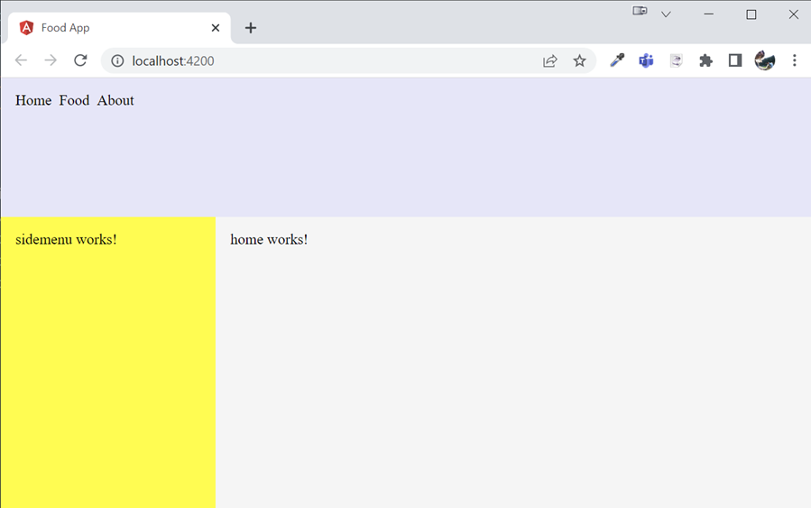
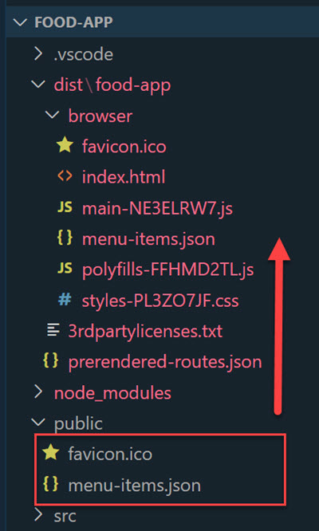

# Create a base Angular App with Layout

In this lab we will create a base Angular App with a layout and a navbar service.

Create the Angular app with the following layout containing the following components:

- home
- shared/sidemenu
- shared/navbar

  

It will load the menu items in the navbar using a navbar.service that takes its values from `assets/menu-items.json`:

## Steps Outlined

- Check the environment setup
- Scaffold the project and add base configuration
- Create the base layout
- Add the menu service and load the menu items in the navbar
- Add support for GitHub Copilot (optional)

## Check the environment setup:

Make sure you have [Visual Studio Code](https://code.visualstudio.com/download), and a [compatible](https://angular.io/guide/versions) node version like [Node 18.17.1](https://nodejs.org/download/release/v18.17.1/) and the lasted [Angular CLI](https://angular.io/cli) installed:

```bash
node --version
ng version
```

Update to the current version of Angular CLI:

```bash
npm i -g @angular/cli
```

>Note: If you have problems execution scripts in PowerShell run: `Set-ExecutionPolicy bypass` in an elevated PowerShell Terminal. 

Also install the [Angular Language Service - Visual Studio Code extension](https://marketplace.visualstudio.com/items?itemName=Angular.ng-template).

## Scaffold the project and add base configuration:

- Create Angular Project using the [Angular CLI](https://angular.io/cli/new):

  ```bash
  ng new food-app --routing --style scss --ssr false
  cd food-app
  ```

  >Note: Add the default routing configuration to the project as it will be used later on. Choose scss as your preferred style schematic. You could change this later on in `angular.json`:

- Examine `main.ts` which bootstraps the application. 

- Examine `app.config.ts` which contains the configuration for the application. It is used to register `services` akn. `providers`. Add `provideHttpClient()` to the providers array. You will use the HttpClient to load the menu items in the navbar later on.

  ```typescript
  export const appConfig: ApplicationConfig = {
    providers: [
      provideZoneChangeDetection({ eventCoalescing: true }),
      provideRouter(routes),
      provideHttpClient()
    ]
  };
  ```

- Examine app.routing.ts which contains the routes for the application. It is used to register `routes` and `router-outlet`. Add the following routes to the routes array:

- Examine the `angular.json` file and notice the default style for the components:

  ```json
  "@schematics/angular:component": {
    "style": "scss"
  }
  ```

- Add the environment configuration to the project on `src/environments`. This will be used to load the menu items in the navbar later on:

  ```bash
  ng g environments
  ```  

- Delete the default content of `app.component.html` and start the Angular dev server. By keeping it running while you are working, you can see the changes in real time and also get error messages in the terminal:

  ```bash
  ng s -o
  ```

  >Note: You can split your terminal to execute other CLI commands

  

- Disable build caching to avoid refresh errors during development:

  ```bash
  ng cache disable
  ```

### Create the base layout

- Examine the [Angular CLI reference](https://angular.io/cli/generate#component-command) on how to add components and execute the following commands in the terminal. Notice that `sidemenu` and `navbar` will be created in the shared folder. You can also use the global `--dry-run` option to see what files will be created without actually creating them:

  ```bash
  ng g c home
  ng g c shared/sidemenu
  ng g c shared/navbar
  ```

- Add a `src/theme/reset.scss` to the project Import the css-reset from [http://meyerweb.com](https://meyerweb.com/eric/tools/css/reset/) to `reset.scss`. Import `reset.scss` in `styles.scss`. While adding the styles directly to `styles.scss` is possible, it is better to keep the styles in a separate file to keep the `styles.scss` file clean and maintainable.

  ```scss
  @use 'theme/reset';
  ```

- Import the three components we created earlier to `app.component.ts`:

  ```typescript
  import { Component } from '@angular/core';
  import { HomeComponent } from './home/home.component';
  import { NavbarComponent } from './shared/navbar/navbar.component';
  import { SidemenuComponent } from './shared/sidemenu/sidemenu.component';

  @Component({
    selector: 'app-root',
    standalone: true,
    imports: [
      HomeComponent,
      NavbarComponent,
      SidemenuComponent
    ],
    templateUrl: './app.component.html',
    styleUrl: './app.component.scss'
  })
  export class AppComponent {
    title = 'first-ng';
  }
  ```

  >Note: In future guides the import statements will be skipped for brevity

- Add the following content to `app.component.html`:

  ```html
  <div>
    <div class="navbar">
      <app-navbar></app-navbar>
    </div>
    <div class="mainrow">
      <div class="sidebar">
        <app-sidemenu></app-sidemenu>
      </div>
      <div class="main">
        <app-home></app-home>
      </div>
    </div>
  </div>
  ```

- Check your browser and open the F12 developer tools to see the layout. You should always check the console for errors, just as you let the Angular dev server running to catch errors at an early stage:

  

- The layout is missing component styles . To add them paste the following styles to `app.component.scss`:

  ```css
  .navbar{
    background-color: lavender;
    height: 150px
  }

  .sidebar{
    background-color: yellow;
    min-width: 200px;
    padding: 1rem;
  }

  .main{
    background-color: whitesmoke;
    width: calc(100vw - 200px);
    padding: 1rem;
  }

  .mainrow{
    display: flex;
    flex-direction: row;
    height: calc(100vh - 150px);
  }
  ```

- Check the browser again and see the layout:

    

### Add the menu service and load the menu items in the navbar  

- Add the navbar service using the Angular CLI:

  ```bash
  ng g s shared/navbar/navbar
  ```

- Create `shared/navbar/nav-item.model.ts` which represents a client side model and add the following content to it. Although you could use Angular CLI for this task it is more straightforward to create the file manually:

  ```typescript
  export class NavItem {
    title = "";
    url = "";
  }
  ```

- Add `menu-items.json` from [artifacts](./artifacts/) to `public/menu-items.json` will contain the data for the menu items. `public` is a folder that will serve static assets. In Angular version prior to 18 the public folder was located at `src/assets`.

  ```json
  [
      {
          "title": "Home",
          "url": "/"
      },
      {
          "title": "Food",
          "url": "/food"
      },
      {
          "title": "About",
          "url": "/about"
      }
  ]
  ```
  
  >Note: A copy of `menu-items.json` is located in the folder of this lab

- Assets is a special folder in Angular that is used to store static files like images, fonts, and JSON files. To check this stop the Angular dev server using CTRL+C and build the application:

  ```json
  ng build
  ```

- Examine the structure of the `dist` folder and notice the `assets` folder containing `menu-items.json`:

    

- In order to be able to dynamically change the url of the menu items to be loaded we will add a global environment configuration using the Angular CLI which will be located in `src/environments`:

  ```bash
  ng g environments
  ```

- Add the following content to `environment.development.ts` and `environment.ts`:

  ```typescript
  export const environment = {
    apiUrl: 'menu-items.json',
  };  
  ```

  >Note: With the assets folder this path was : 'assets/menu-items.json',

- Inject Angular HttpClient that you configured in `app.config.ts` in the constructor of `navbar.service.ts` and load `assets/menu-items.json`:

  ```typescript
  export class NavbarService {
    http = inject(HttpClient);

    getItems() {
      return this.http.get<NavItem[]>(environment.apiUrl);
    }
  }
  ```

- Inject `navbar.service` in `navbar.component.ts` and get the menu items:

  ```typescript
  export class NavbarComponent implements OnInit {
    ns = inject(NavbarService);
    navItems: NavItem[] = [];

    ngOnInit() {
      this.ns.getItems().subscribe((data) => {
        this.navItems = data;
      });
    }
  }
  ```

- Render the menu items in `navbar.component.html` using Angular's [built-in control flow](https://angular.io/guide/control_flow):

  ```html
  <div class="menu">
    @for (item of navItems; track item) {
    <div class="menuItem">{{ item.title }}</div>
    }
  </div>
  ```

- Style `navbar.component.scss`:

  ```css
  .menu{
      display: flex; 
      width: 100%;
      flex-direction: row;
      padding: 1rem;
  }

  .menuItem{
      margin-right: 0.5rem;    
      &:hover{
          text-decoration: underline;
          cursor: pointer;
      }
  }
  ```

- Run the application and check the browser:

  ```bash
  ng s -o
  ```

### Add support for GitHub Copilot (optional)

>Note: If you do not want to use GitHub Copilot you can skip this step.

GitHub Copilot is an AI pair programmer that offers a [free tier](https://github.com/features/copilot/plans?cft=copilot_li.features_copilot) that you can use to speed up your development process. 

It is available as a Visual Studio Code extension. You can install it from the [Visual Studio Code Marketplace](https://marketplace.visualstudio.com/items?itemName=GitHub.copilot). There is also an extension for [intellij](https://plugins.jetbrains.com/plugin/17718-github-copilot) available. Both extensions require a [GitHub account](https://github.com/pricing) that is also free.

- Install the extensions in Visual Studio Code:

  ```bash
  code --install-extension GitHub.copilot
  code --install-extension GitHub.copilot-chat
  ```

- Follow these [steps](https://code.visualstudio.com/docs/copilot/setup) to activate GitHub Copilot.

We will configure settings for this project that enhance the GitHub copilot experience for Angular development by overriding (ground) newer Angular patterns that might not be contained in the Large Language Model (LLM) that GitHub Copilot is based on.

- Read and copy `.angular.copilot.md` and `.angular.tests.copilot.md` from [artifacts](./artifacts/) to the root of the project. These files contain settings that will be used by GitHub Copilot to generate code snippets for Angular development. 

- To register these files copy settings.json from [artifacts](./artifacts/) to `.vscode` in the root of the project. This will enable the settings for the project.  