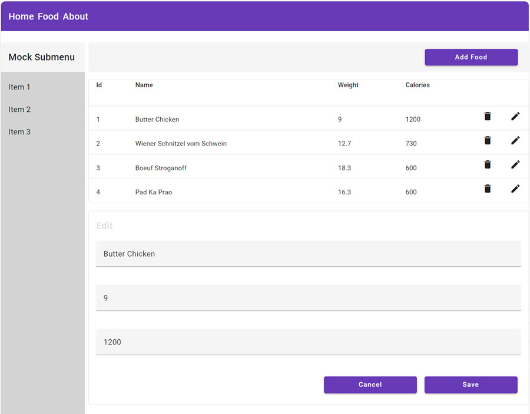

# Implement a Responsive User Interface Using Angular Material and CSS Grid  
   
In this lab, you will learn how to create a responsive user interface for a Food App using Angular Material and CSS Grid. By following the steps outlined, you will install Angular Material, implement Material Design components, and utilize CSS Grid for layout management. Additionally, you will explore how to customize your application’s theme, enhancing its visual appeal and user experience.  
   
## Steps Outlined  
- Install Angular Material and create a base responsive layout  
- Implement a Material Design for the Food App  
- Implement a custom Material Theme (optional)  
   
### Install Angular Material and Create a Base Responsive Layout  
- Begin by adding Angular Material to your project, utilizing the [Material Getting Started](https://material.angular.io/guide/getting-started) guide, and select a theme that aligns with your design vision.  
    
- Verify the successful installation of Angular Material by replacing the existing `div` in the `navbar.component.html` with a [Material Toolbar](https://material.angular.io/components/toolbar/overview). To accomplish this, ensure you import the `MatToolbarModule` from `@angular/material/toolbar` within the `navbar.component.ts` file.  
    
- Develop the base layout of the application using CSS Grid. Modify the layout in `app.component` to leverage [CSS Grid](https://css-tricks.com/snippets/css/complete-guide-grid/). Refer to the layouts in [main.component.html](/demos/05-ui/ng-user-interface/src/app/main/main.component.html) and [main.component.scss](/demos/05-ui/ng-user-interface/src/app/main/main.component.scss) for guidance. You may also utilize online tools such as the [CSS Grid Generator](https://grid.layoutit.com/) to facilitate the grid layout creation.   
  
    - Implement a responsive design by hiding the sidebar on devices with a screen width less than `960px`. A toggle button will be added in a future lab, so for now, consult [demo-container.component.scss](/demos/05-ui/ng-user-interface/src/app/demos/demo-container/demo-container.component.scss) for a reference on media queries.  
   
- Add `stylePreprocessorOptions` to the `angular.json` configuration file to include the `src/theme` folder in your SCSS files. This will allow for more manageable imports across your application.  
  
    ```typescript  
    "styles": [  
        ...  
    ],  
    "stylePreprocessorOptions": {  
        "includePaths": ["src/theme"]  
    },  
    "scripts": []  
    ```  
  
    > Note: This configuration enables the use of shorter paths when importing global SCSS files into components. For example, you can use `@import 'theme';` instead of `@import 'src/theme';`. 

### Implement a Material Design for Food App

- A possible design for the Food App is shown below. You can use this as a reference when implementing the user interface. 

    

- Use [mat-card](https://material.angular.io/components/card/overview) elements in `food-list.component.html` and `food-edit.component.html` to surround the content. You will have to import the following modules in the respective components:    
    - MatToolbarModule
    - MatCardModule
    - MatTableModule
    - MatIconModule
    - MatButtonModule
    - MatInputModule
    

- Use [mat-table](https://material.angular.io/components/table/overview) for the `food-list.component.html`

    >Note: The material table receives its values from the following line:

    ```typescript
    @Input() food: FoodItem[] = [];
    ```
    When items in the table are updated, the ngOnChanges lifecycle hook is used to update the table:

    ```typescript
    ngOnChanges(changes: SimpleChanges) {
        this.dataSource = new MatTableDataSource(changes["food"].currentValue);
    }
    ```

- Implement `foodSelected`, `foodDeleted`, and `foodAdding` in `food-list.component.ts`. Adding is triggered by the `Add Food` button and handled by the parent component `food-container.component.ts`. I implemented it here to be able to place the button in the toolbar.

- Wrap the `food-edit.component.html` in a `mat-card` and use the [mat-form-field](https://material.angular.io/components/form-field/overview) and [mat-input](https://material.angular.io/components/form-field/overview) for the input fields.

    ```html
    <mat-form-field>
        <input matInput type="text" placeholder="Name" [(ngModel)]="food.name" />
    </mat-form-field>
    ```

- Use the [mat-button-directive](https://material.angular.io/components/button/examples) for the `Save`-button in `food-edit.component.html` and the `Add Food`-button in `food-list.component.html`. You might notice that the button have different widths. We will fix this in the next step when implementing a custom Material Theme.

- Add the `burger.png` file as a centered image to the `home.component.html` and use a custom [web font](https://fonts.google.com/) in the welcome text by registering it in `index.html`.

    

### Implement a custom Material Theme - optional

- Implement a custom material theme with a [custom color palette](https://material.io/resources/color/#!/?view.left=0&view.right=0) and replace the theme that you have chosen at the beginning of this lab:

- Use the [Demo App Theme](/demos/05-ui/user-interface/src/styles.scss) as a reference.