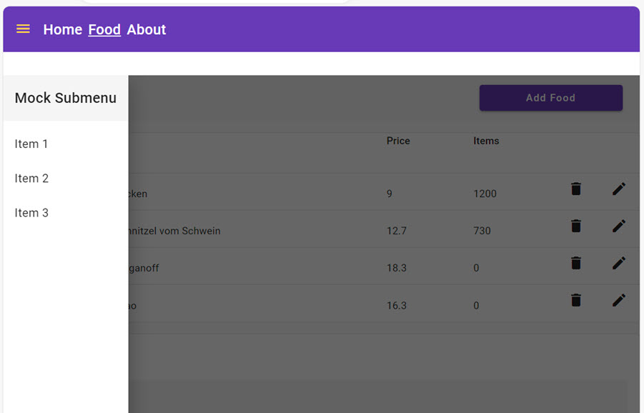

# Reactive Programming and State Management

In this lab we will implement a Side Menu and a global Loading Indicator using RxJS and Stateful Services. In order to achieve this we will use the [Angular Material Sidenav](https://material.angular.io/components/sidenav/overview). The Sidenav will be controlled by the [BreakpointObserver](https://material.angular.io/cdk/layout/overview) from the Material CDK.



## Steps Outlined

- Add a Signal based SideMenuService
- Implement a responsive Side Menu using Angular Material Sidenav

### Add a Signal based SideMenuService

- Generate `sidemenu.service.ts` using Angular CLI

  ```bash
  ng g s shared/sidemenu/sidemenu 
  ```

- Use [sidenav.service.ts](/demos/07-reactive-state/reactive-state/src/app/shared/sidenav/sidenav.service.ts) as a reference to implement the `sidemenu.service.ts`. Do not copy past but basically it would work the same way. 

- Modify nav.component.html to use the SideMenuService

  ```html
  <mat-toolbar color="primary">
    <mat-toolbar-row>
      <div class="hamburgerMenu" (click)="toggleMenu()">
        <mat-icon color="accent">menu</mat-icon>
      </div>
  ```

- Add a required css to nav.component.scss

  ```css
  .hamburgerMenu{
    cursor: pointer;
    display: none;
    padding-top: 0.5rem;
    margin-right: 1rem;
  ;
    @media only screen and (max-width: 960px) {
      display: block;
    }
  }
  ```

- Next we will refactor the imperative code to get the `navItems` to a reactive approach using Signals. Remove the ngOnInit as we no longer need it.

  ```typescript
    ngOnInit() {
      this.nav.getItems().subscribe((data) => {
        this.navItems = data;
      });
    }
  ```

- Set navItems in a declarative way using the SideMenuService

  ```typescript
  nav = inject(NavbarService);
  navItems = this.nav.getItems();
  ```  

- Update the corresponding html to use the `navItems` Observable. You might need to import the `async` pipe from `@angular/common`.

  ```html
  @for (item of navItems | async; track item) {
    <div
      class="menuItem"
      routerLink="{{ '/' + item.url }}"
      routerLinkActive="navLinkActive"
      [routerLinkActiveOptions]="{ exact: true }"
    >
      {{ item.title }}
    </div>
    }
  ```

- Inject the SideMenuService to the `nav.component.ts` and implement the `toggleMenu` method.

  ```typescript
  export class NavbarComponent {
    sideMenu = inject(SideMenuService);
    nav = inject(NavbarService);
    navItems = this.nav.getItems()

    toggleMenu() {
      this.sideMenu.toggleMenuVisibility();
    }
  }
  ```

- Check the behavior in the browser

### Implement a responsive Side Menu using Angular Material Sidenav

- Implement a menu.service.ts as a Stateful Service using BehaviorSubjects with the two properties:

    - sideNavVisible: boolean
    - sideNavPosition: over | side

- Add a Material Sidenav to app.component.html    

  ```html
  <div class="grid">
    <div class="gd-navbar">
      <app-navbar></app-navbar></div>
    <div class="gd-loading">
      <!-- <app-loading *ngIf="isLoading | async"></app-loading> -->
    </div>
    <div class="gd-mainrow">
      <mat-sidenav-container>
        <mat-sidenav #sidenav class="sidenav"
            [opened]="sidenavVisible | async"
            [mode]="(sidenavMode | async) ?? 'side'">
          <app-sidemenu></app-sidemenu>
        </mat-sidenav>
        <mat-sidenav-content [ngStyle]="workbenchMargin | async">
          <router-outlet></router-outlet>
        </mat-sidenav-content>
      </mat-sidenav-container>
    </div>
  </div>
  ``` 
- Add a required css to app.component.scss

  ```css
  .grid {
    display: grid;
    height: 100vh;
    width: 100%;
    gap: 0.5rem;
    grid-template-rows: 70px 10px calc(100vh - 100px);
    grid-template-columns: auto;
    grid-template-areas:
      "navbar"
      "loading"
      "mainrow";
  }

  .gd-navbar {
    grid-area: navbar;
  }

  .gd-loading {
    grid-area: loading;
  }

  .gd-mainrow {
    grid-area: mainrow;
    background-color: lightgray;
  }

  .sidenav{
    height: 80vh;
  }
  ```

- Take the [demo.container](/demos/07-rxjs-state/ng-reactive/src/app/demos/demo-container/) and the [sidenav.service.ts](/demos/07-rxjs-state/ng-reactive/src/app/shared/sidenav/sidenav.service.ts) as a reference.