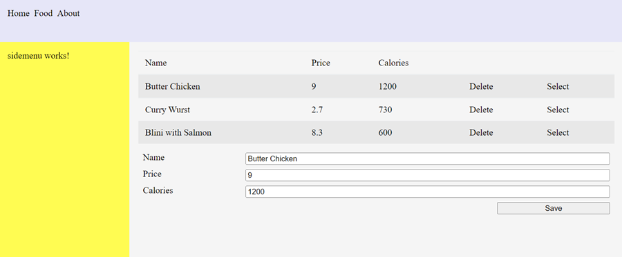

# Food Container / Presenter

In this lab we will implement a container / presenter pattern to manage food. 



>Note: At the moment do not use Angular Material. Just put the `input`-tags into `div`-tags. 

## Steps Outlined

  - Use the following nested components that you will create using the [Angular CLI](https://angular.io/cli/generate#component-command):

  - food/food-container -> container
  - food/food-list -> nested in container
  - food/food-edit -> nested in container

  Example:

  ```
  ng g component food/food-container
  ```

  >Note: Repeat the above command for `food-list` and `food-edit`

Add the `food-container` component to `app.component.html`. Routing will be implemented later on. 

```html
<div class="main">
    <app-food-container></app-food-container>
</div>
```

Add a `food.model.ts` file to folder `app/food`:

```typescript
export class FoodItem {
  id: number = 0;
  name: string = "";
  price: number = 0;
  calories: number = 0;
}
```

Implement a `food/food-service.ts` using the following `food.model.ts` model:

```
ng g service food/food
```

Inject the [Angular HttpClient](https://angular.io/guide/http) client into `food/food-service.ts` by adding `HttpClientModule` to `app.module.ts`

Implement a `getFood()` method in food-service and load the data from `assets/food.json`:

```json
[
  { "id": 1, "name": "Butter Chicken", "price": 9, "calories": 1200 },
  { "id": 2, "name": "Curry Wurst", "price": 2.7, "calories": 730 },
  { "id": 3, "name": "Boeuf Stroganoff", "price": 18.3, "calories": 600 }
]
```
Use the following reference: 

- [Load Data in Service](../../../demos/03-fundamentals/fundamentals-modules/src/app/demos/samples/persons/person.service.ts)

Implement a Container-Presenter Pattern in `food/food-container`, `food/food-list` and `food/food-edit`. Use the following reference: 

- [Container](../../../demos/03-fundamentals/fundamentals-modules/src/app/demos/samples/container)

- [Presenter](../../../demos/03-fundamentals/fundamentals-modules/src/app/demos/samples/persons/)

You might also have to import [FormsModule](https://angular.io/guide/frequent-ngmodules) into `app.module.ts` in order to use the `ngModel` directive in `food-edit.component.html`

Implement `Select` and `Delete` in the list and `Save` in the edit component.

Use the following code to implement `foodSaved()` in the container and hide the edit form after an item has been saved.

```typescript
foodSaved(item: FoodItem) {
  const clone = Object.assign([], this.food) as Array<FoodItem>;
  let idx = clone.findIndex((c) => c.id == item.id);
  if (idx > -1) {
    clone[idx] = item;
  } else {
    clone.push(item);
  }
  this.food = clone;
  this.selected = null;
}
```